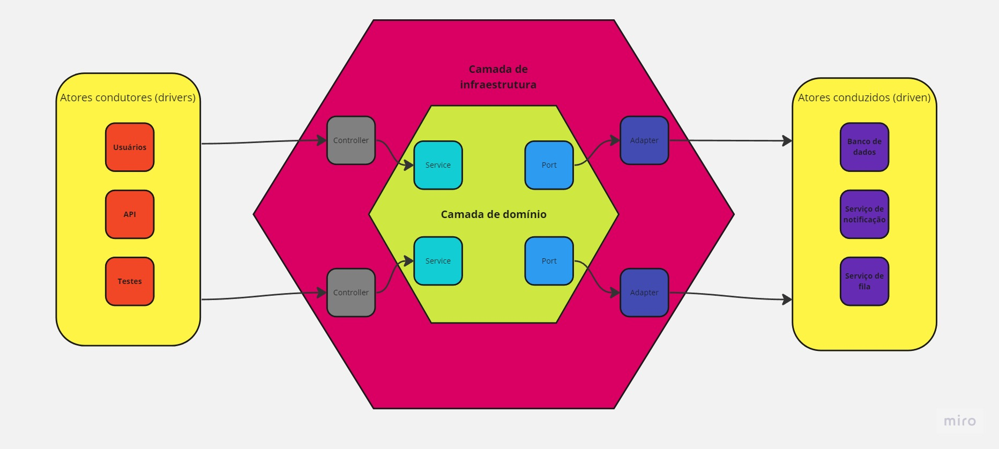
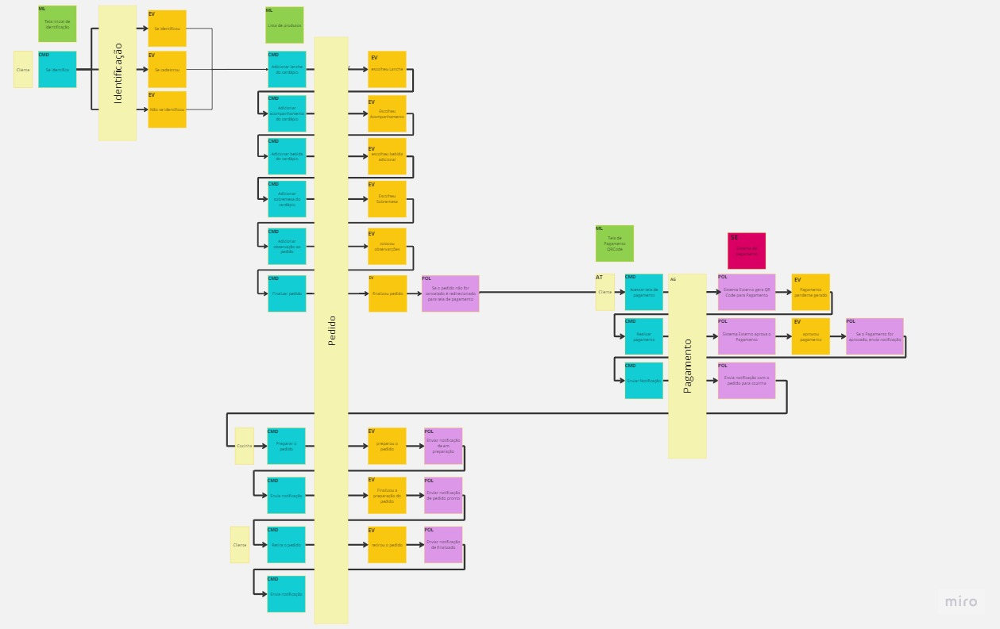

<h1 align="center">
    Hexafood
</h1>

## :boat: Sobre o projeto

Esse projeto faz parte do trabalho "Tech Challenge - Fase 01", ministrado no primeiro módulo do curso de Pós Graduação Software Architecture da FIAP em parceria com a Alura. 

Para exercitar os conceitos apresentados nas primeiras matérias do curso, sendo elas sobre Domain Driven Design (DDD), Docker e Arquitetura de Software, foi desenvolvido uma aplicação backend em Typescript no framework NestJS, com o design de código adaptado para representar os princípios da Arquitetura Hexagonal, tambem conhecida como abordagem de Portas e Adpatadores (Ports and Adapters).

## :hammer: Tecnologias:
- **[Typescript](https://www.typescriptlang.org)**
- **[NestJS](https://nestjs.com/)**
- **[PostgreSQL](https://www.postgresql.org/)**
- **[JestJS](https://jestjs.io/pt-BR/)**

## :rocket: Como rodar esse projeto
Se você estiver usando Windows, vai precisar do WSL para rodar esse projeto de forma prática. Para isso, você pode instalá-lo seguindo o seguinte [tutorial](https://learn.microsoft.com/pt-br/windows/wsl/install). Também será necessário uma distribuição linux para utilizar o WSL. Recomendo o Ubuntu que pode ser baixando na própria Microsoft Store no [link](https://apps.microsoft.com/store/detail/ubuntu/9PDXGNCFSCZV). 
Depois, vai precisar do Docker, o qual a versão de Windows pode ser encontrada [aqui](https://docs.docker.com/desktop/install/windows-install/).
Então, clone o projeto dentro do WSL, vá para pasta dele e execute o comando:
```
docker compose build --no-cache
```
Após a construção da imagem, basta executar o comando:
```
docker compose up
```
O projeto estará executando no endereço http://localhost:3000/.

Para executar os testes de unidades, execute o comando:
```
docker compose exec api yarn test
```

Para limpar o volume db do docker, execute o comando:
docker-compose down -v


## :electric_plug: Arquitetura Hexagonal (Ports and Adapters)
Cunhado em meados dos anos 1990 pelo Dr. Alistair Cockburn, a Arquitetura Hexaognal surgiu com o principal objetivo de construir sistemas alto nível de coesão e baixo nível de acoplamento, aplicando a Separação de Conceitos (SoC - Separation of Concerns) em diversos níveis da aplicação. 

De forma parecida com a Arquitetura Limpa (Clean Architecture), o foco é favorecer a reusibilidade do código, desenvolvendo camadas e módulos de fácil testabilidade, e independência de tecnologia. A camada de domínio ou o coração do software como chamamos no Domain Driven Design, são desenvolvidos a fim serem totalmente independentes de fatores externos e detalhes de implementação, facilitando possíveis mudanças complexas como por exemplo a troca do próprio framework.

Embora a arquitetura tenha ficado famosa com o nome de hexagonal, o conceito atual é baseado em portas e adaptadores, onde pode-se definir:
- O centro do hexágono é o que representa a camada de domínio e coração do software;
- As portas de entrada são as interfaces usadas para a comunicação de fora do hexágono para dentro, como por exemplo um caso de uso ou uma classe de serviço;
- As portas de saída são as interfaces usadas para a comunicação de dentro para o hexágono para fora, como uma classe de acesso ao banco de dados;
- Adaptadores são as implementações concretas fora do centro hexágono que realizam de fato as conexões com os serviços externos (atores conduzidos);
- Atores Contudores são aqueles que interagem com nossa aplicação com solicitações através de alguma camada de controle, nesse caso podendo ser representado por suítes de testes, usuários ou até uma API;

<br>
<h4 align="center">
    
</h4>
<br>

## :open_file_folder: Arquitetura na prática 
De forma a representar no sentido mais literal, a organização de arquivos desse projeto foi feita no intuito de apresentar de forma explicitamente semântica a arquitetura hexagonal, embora reconhecemos que o importante são as abstrações e reduçào de nível de acoplamento nas classes principais do projeto (e não os nomes as pastas).

Durante o processo de modelagem do fluxo de realização de pedido através da técnica do Event Storming do DDD (disponível para melhor visualização [aqui](https://miro.com/app/board/uXjVMK9Pt7E=/)), foram identificados três agregados os quais consideramos também potenciais candidatos a serem Contextos Delimitados:
- Identificação
- Pedido
- Pagamento
<br>
<h4 align="center">
    
</h4>
<br>
Dessa forma, visando aproveitar a estrutura modular do NestJS, os três foram separados em módulos:

```
.
├── src (separação do código fonte por módulos)
│   ├── identificacao
│   ├── pedido
│   └── pagamento
├── test
│   └── [arquivos de teste]
├── package.json
├── package-lock.json
└── README.md

```

Adentrando no módulo Identificação para exemplificação, temos a representação da arquitetura partindo de dois diretórios:
- Adapter: onde estarão todos atores condutores(driver) e conduzidos(driven) do sistema
- Core: onde estará o coração do software, separado no que concerne a lógica da aplicação (application) e por consequência as portas(ports) que ela precisa para se comunicar com os atores conduzidos, as classes de serviços (services), e a camada de domínio onde estarão as entidades e validações de regra de negócio.

```
.
├── src
│   ├── identificacao
│   │   ├── adapter
│   │   │   ├── driver
│   │   │   │   └── clientes.controller.ts
│   │   │   └── driven
│   │   │       └── infrastructure
│   │   │           └── clientes.repository.ts
│   │   └── core
│   │       ├── application
│   │       │   ├── ports
│   │       │   │   └── repositories
│   │       │   │       └── clientes.repository.ts
│   │       │   └── services
│   │       │       └── clientes.service.ts
│   │       └── domain
│   │           └── clientes
│   │               └── entities
│   │                   └── cliente.entity.ts
```

## :microscope: Testabilidade

Considerando o uso de portas para a camada de serviços do coração do software se comunicar com serviços externos, torna-se o possível do uso de injeção de dependência para mudar o comportamento padrão do sistema e dessa forma fazer testes de unidades totalmente independentes. Como por exemplo no teste de ClientesService foi injetado um repositório de clientes em memória para que não precisássemos de banco de dados durante os testes de unitários, dessa forma reforçando o conceito de pirâmide testes:
```ts
import { Test, TestingModule } from '@nestjs/testing';
import { IClientesRepository } from '../../src/identificacao/core/application/ports/repositories/clientes.repository';
import { ClientesService } from '../../src/identificacao/core/application/services/clientes.service';
import { InMemoryClientesRepository } from '../../src/identificacao/adapter/driven/infrastructure/in-memory-clientes.repository';
import { Cliente } from '../../src/identificacao/core/domain/clientes/entities/cliente.entity';

describe('ClientesService', () => {
  let service: ClientesService;
  let repository: IClientesRepository;

  beforeEach(async () => {
    const module: TestingModule = await Test.createTestingModule({
      providers: [
        //Nessa parte do código, injetamos o adapter InMemoryClientesRepository na porta IClientesRepository, para alterar o comportamento padrão do sistema e realizar os testes de unidade de ClientesService
        {
          provide: IClientesRepository,
          useClass: InMemoryClientesRepository,
        },
        ClientesService,
      ],
    }).compile();

    repository = module.get<IClientesRepository>(IClientesRepository);
    service = module.get<ClientesService>(ClientesService);
  });

  describe('create', () => {
    it('should create a new client and return it', async () => {
      const clienteData: Cliente = { id: 1, nome: 'Sr. Teste 1', cpf: '123' };
      const result = await service.create(clienteData);
      expect(result).toEqual(clienteData);
    });
  });
});

```

## :bookmark_tabs: Licença

Este projeto esta sobe a licença MIT. Veja a [LICENÇA](https://opensource.org/licenses/MIT) para saber mais.

## :wink: Autores
Feito com ❤️ por: 
- [Bruno Padilha]()
- [Lucas Siqueira](https://www.linkedin.com/in/lucassouzatidev/)
- [Marayza]()
- [Mario Celso]()
- [Rafael]()

